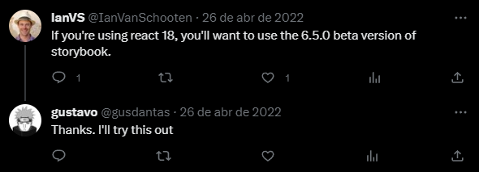

import { Head } from 'mdx-deck';
import Code from './Code';

<Head>
  <link rel="preconnect" href="https://fonts.googleapis.com" />
  <link rel="preconnect" href="https://fonts.gstatic.com" crossorigin />
  <link
    href="https://fonts.googleapis.com/css2?family=Nunito:wght@400;500;700&display=swap"
    rel="stylesheet"
  />
  <link href="https://fonts.cdnfonts.com/css/cascadia-code" rel="stylesheet" />
  <title>
    Imersão Comp Júnior - Como mostrar que você é capaz e explicando algumas
    tecnologias
  </title>
</Head>

# Bom momento!

---

# Você é capaz?

---

# Learn in public

- [Learn in public - Swyx](https://www.swyx.io/learn-in-public)
- Você já sabe que nunca irá parar de aprender. Mas a maioria das pessoas “aprendem no privado”, e apenas observam.
- Consomem conteúdo sem produzir nada.

---

# Como aprender em público?

- O que você fará aqui é desenvolver um **hábito de “criar aprendizado”**
  - Crie blogs, tutorias e passo-a-passo
  - Apresente em meetups, techshots, eventos, etc...
  - Pergunte e responda no Stackoverflow ou Reddit.
  - Faça videos no Youtube ou Twitch.

---

### Produza o **conteúdo que você gostaria de ter encontrado** quando você estava aprendendo

- Não se preocupe com engajamento, likes, etc...
- Faça o conteúdo para você mesmo de 3 meses atrás
- Reconhecimento é um bônus

---

## Exemplo pessoal

---


---



---

# Usando tecnologias a SEU favor

---

<Code
  title="O JavaScript é maluco!"
  code={require('!raw-loader!./code/js-vs-ts.js')}
  showNumbers={false}
  dark={true}
  lang="ts"
  steps={[
    { range: [0, 3], notes: 'É apenas uma função que soma dois números...' },
  ]}
/>

---

<Code
  title="E se?"
  code={require('!raw-loader!./code/js-vs-ts.js')}
  showNumbers={true}
  dark={true}
  lang="ts"
  steps={[{ range: [4, 5], notes: 'O que é retornado?' }]}
/>

---


---

<Code
  title="Piorando as coisas..."
  code={require('!raw-loader!./code/js-vs-ts.js')}
  showNumbers={false}
  dark={true}
  lang="ts"
  steps={[{ range: [7, 13], notes: 'O que é retornado?' }]}
/>

---


---

## Melhorando as coisas com Typescript

- Adiciona tipagem estática
- Não é uma linguagem diferente
- Suporte a orientação a objeto
- Melhor documentação
- Melhor autocompletar
- Bom para prevenir erros

---

<Code
  title="Melhorando as coisas"
  code={require('!raw-loader!./code/js-vs-ts.ts')}
  showNumbers={false}
  dark={true}
  lang="ts"
  steps={[
    { range: [0, 5], notes: 'Mesma coisa que antes, só que diferente...' },
  ]}
/>

---


---

<Code
  title="Melhorando as coisas"
  code={require('!raw-loader!./code/js-vs-ts.ts')}
  showNumbers={false}
  dark={true}
  lang="ts"
  steps={[
    { range: [7, 11], notes: 'Adicionando os tipos' },
    { range: [13, 21], notes: 'Declarando o nosso objeto' },
  ]}
/>

---

## Typescript === perfeição??

---

## CI/CD

- Integração contínua
- Entrega contínua

- "conjunto de práticas que permitem aos desenvolvedores criar, testar e lançar software de forma rápida e confiável."

---

## Alguns exemplos

- [GitHub Actions](https://docs.github.com/pt/actions)
  - Automatize testes, builds, deploy
  - Basta você ter seu repositório no GitHub e escolher a forma e como você quer fazer o deploy

---

## Mas como VOCÊ se beneficia com isso?

---

## Crie seu próprio portfolio!

- Não importa se você é inimigo do CSS
- Não importa se você não faz a menor ideia de como começar
- Apenas comece!

---

# Começando!

---

## Astro

- [Astro.build](https://docs.astro.build/pt-br/getting-started/): O Astro constrói sites de conteúdo rápido, focado em conteúdo
- Suporte nativo ao Typescript
- Suporte a bibliotecas como React e Vue
- Documentação MUITO BOA
- Suporte nativo para conteúdos markdown
- Fácil e custo zero com deploy utilizando GitHub Pages
- Menos preocupação com estruturação

---

## Chega de teoria

- <https://github.com/withastro/astro/tree/main/examples/blog>

```bash
npm create astro@latest -- --template blog
```

- Mude conforme achar necessário!
- Faça o [deploy](https://docs.astro.build/pt-br/guides/deploy/github/)!

---

# Chegamos ao fim


